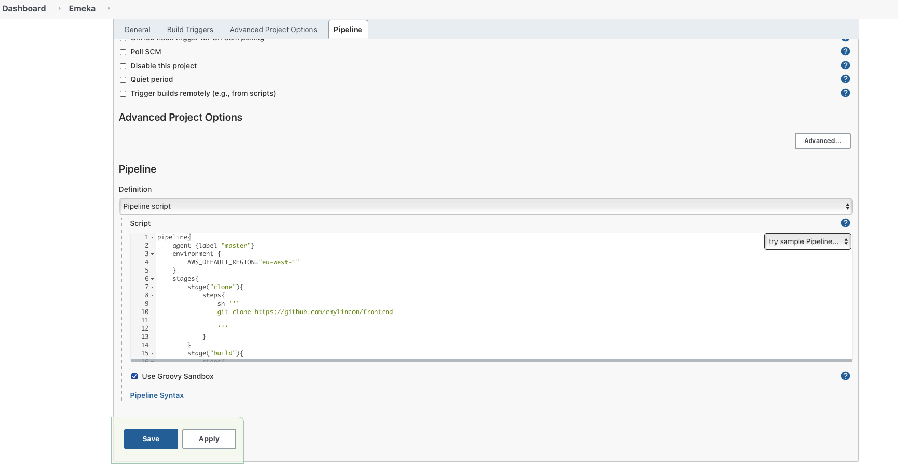

# Jenkins Pipeline for ECS Farget using Terraform and docker compose
This is a pipeline that can be used to create a jenkins ecs job running on amazon web service.

## How to Setup
### Terraform
First you provision the jenkins server on aws using terraform
* initialize the terraform workspace
```
terraform init
```
* export aws credential for terraform to authenticate your account
```
export AWS_ACCESS_KEY_ID="AXXXXXXXXXXXXXX"
export AWS_SECRET_ACCESS_KEY="EXXXXXXXXXXXXXXXXXXXXXXXXXX"
```
* create rsa ssh keys to login to server (this should create `~/.ssh/id_rsa` and `~/.ssh/id_rsa.pub`)
```
ssh-keygen -t rsa
```
* Provision ubuntu jenkins server on aws
```
terraform apply
```

### Jenkins

#### Access jenkins server and install plugins
* Run `terraform output` to access the ip address of your jenkins server 
* install suggested plugins and create user details
* before creating new job install the aws jenkins credential
* go to `manage jenkins > manage plugins > available` and search and install without restart `CloudBees AWS Credentials`


#### Add aws and docker credentials to jenkins
* now add your aws and docker credentials to jenkins
* go to `manage jenkins > manage credentials > global > add credentials`
* change kind to aws credentials and add your aws Access Key ID and aws Secret Access Key
* IMPORTANT, set the ID to `aws_credential`

* Do the same for docker credentials but set the kind to `username with password`
* IMPORTANT, set the ID to `docker`

#### Create Job
* go to `new item` and enter name, choose `pipeline` and click `OK`

* navigate to pipeline and copy and paste the script in `Jenkinsfile1`

* apply and save
* then trigger build

